# Telegram Bot für n8n, make oder OpenClaw erstellen
### Als Trigger oder für die Kommunikation zwischen User und KI wird oft Telegram benutzt.
Um Telegram für diese Zwecke nutzen zu können benötigt man zunächst einen Telegram Account. 
Mit diesem Account können anschiessend bis zu 20 Bots erstellt werden. 
## Wie viele Bots brauche ich?
Für jede laufende Automatisierung brauche ich einen Bot. Sollen mehrere Automatisierungen gleichzeitig laufen, sagen wir
5 Automatisierungen gleichzeitig, bauche ich 5 Bots.  
Läuft aber immer nur EINE Automatisierung, könnten alle 5 Automatisierungen den selben Bot benutzen.

## Schritt für Schritt zum eigenen Telegram Bot
### Schritt 1
Im chat nach BotFather suchen, dem "SuperBot" von Telegram, der neue Bots erstellen kann und mit dem
eigene Bots verwaltet werden können. 
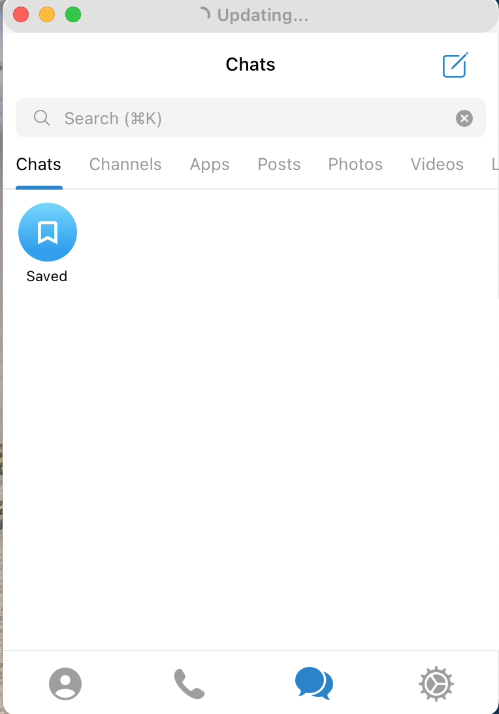

### Schritt 2
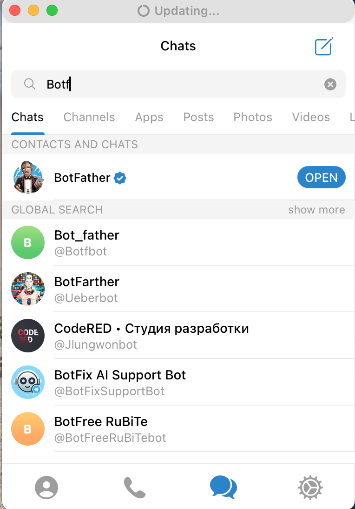

### Schritt 3
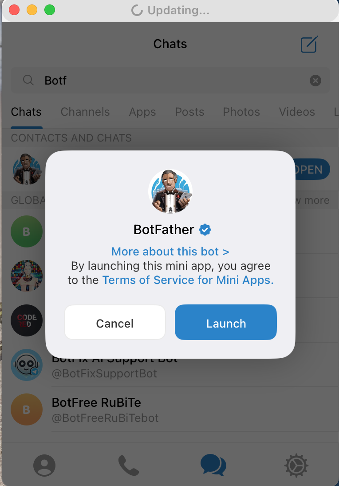

### Schritt 4
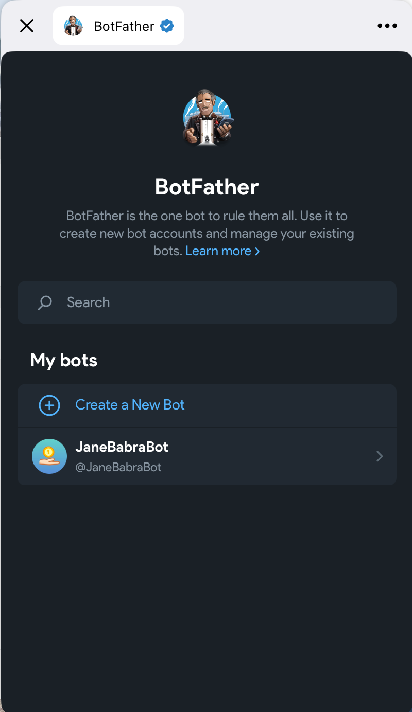

### Schritt 5
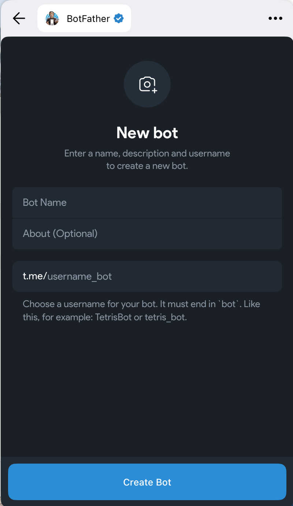

### Schritt 6
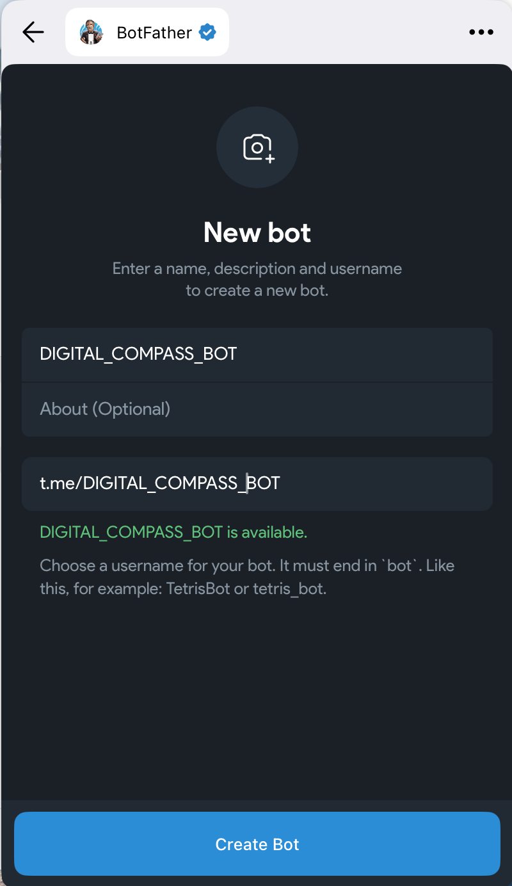

### Schritt 7
Auf COPY klicken und den Token für diesen Bot in die KI Automatisierung einfügen.
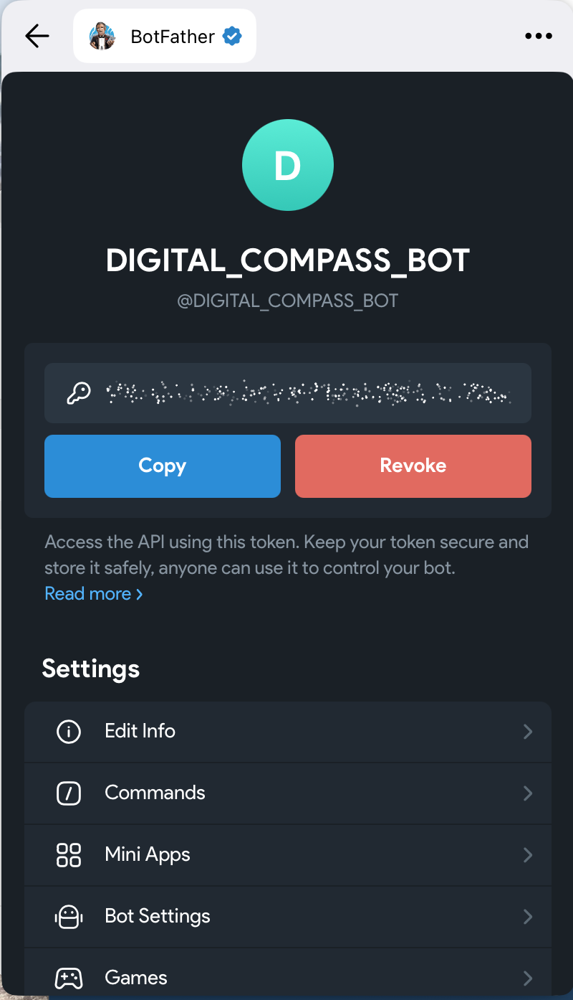

### Schritt 8
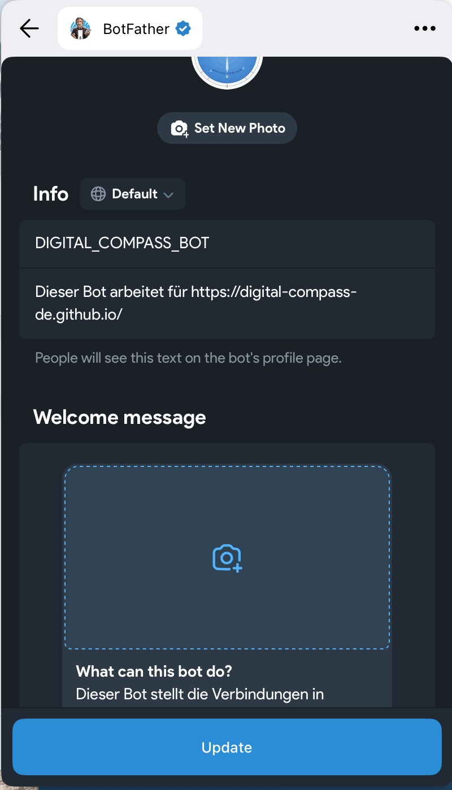

### Schritt 9
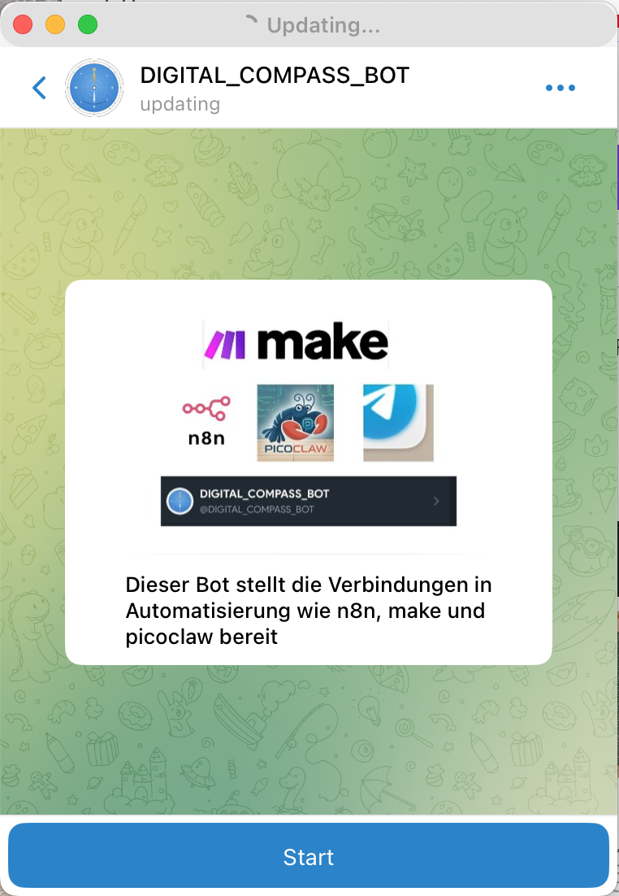

### Schritt 10
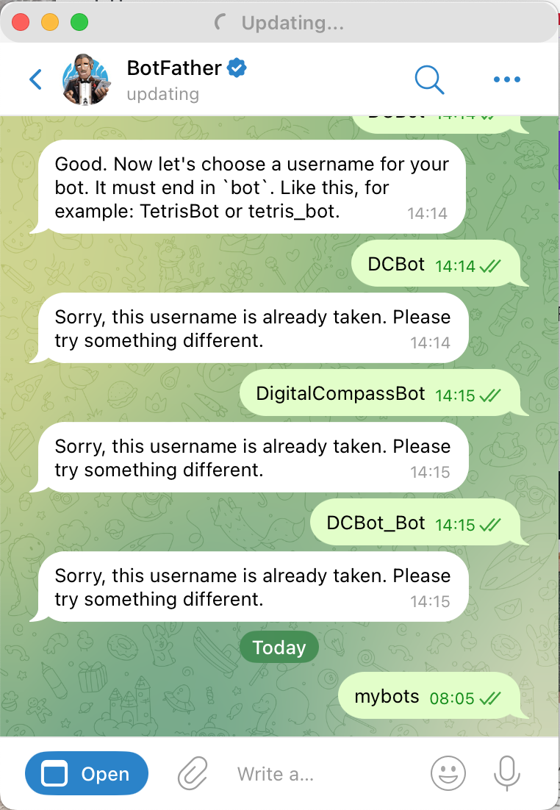

### Schritt 11
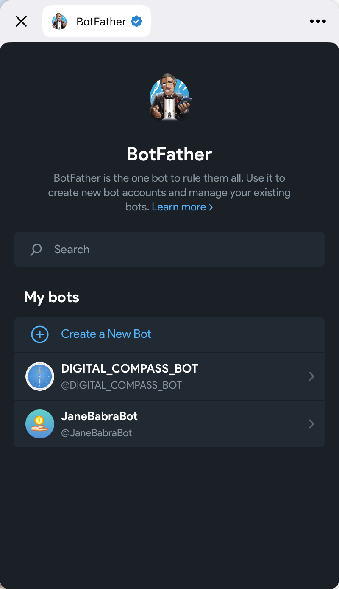

## Sicherheit
Bots sind public und können von jedem Telegram der Telegram nutzt gefunden werden. Um zu verhindern, das dein Bot
von anderen benutzt werden kann, wird die User ID (also die ID des Accounts, nicht des Bots) in die KI Software 
eingetragen, so das nur mit Bots von diesem Account gearbeitet wird.
#### Abfragen der User ID
Im chat Fenster nach "my_id_bot" suchen, auswählen und auf /start klicken, anschliessend gibt der Bot die User ID zurück.

